<table>
<tr>
<td valign="top"></td>
<td valign="top"></td>
</tr>
</table>

 

<h1><code>$ whoami</code></h1>

<h3>Yash Sharma</h3>

Software Engineer · Backend & Full-Stack (.NET / Java)

---

### `$ cat about.txt`

- 🔭 Building backend systems with **.NET** and **Java**, with React on the front end
- 🛠️ Comfortable across the full stack — from SQL Server to Docker to CI/CD
- 📦 Ship and deploy using **Docker** and **GitLab**
- 📫 Reach me via GitHub — [@yash9283](https://github.com/yash9283)

---

### `$ ls ./skills`

<table>
<tr>
<td valign="top" width="50%">

**Languages & Frameworks**

</td>
<td valign="top" width="50%">

**Data & Tooling**

</td>
</tr>
</table>

---

### `$ git log --stats`

---

### `$ cat contact.log`

Built with ❤️ from a terminal, not a template.

